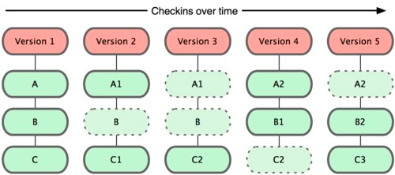
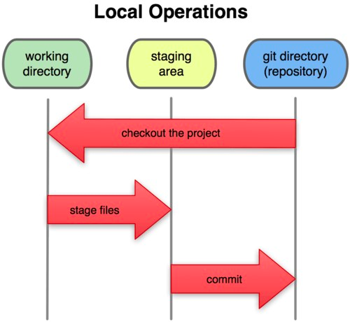
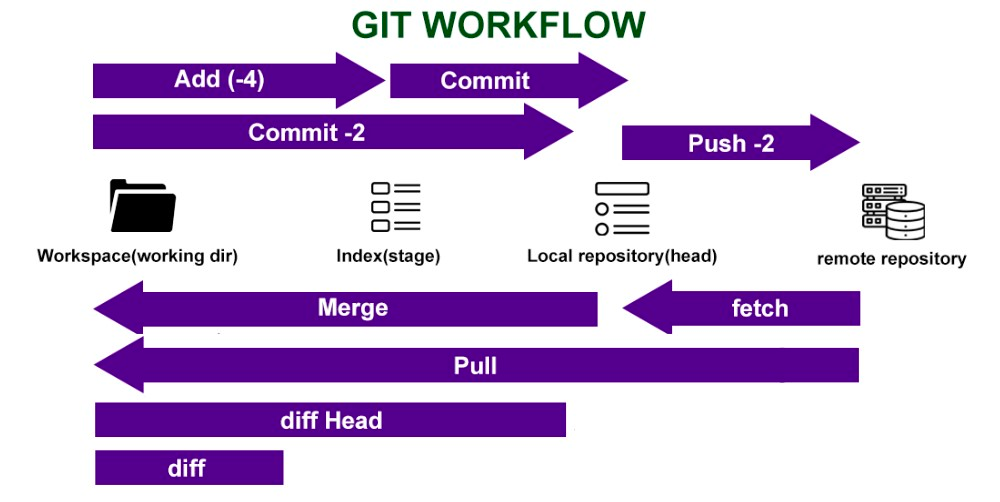
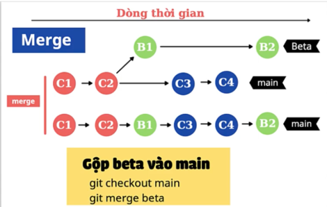
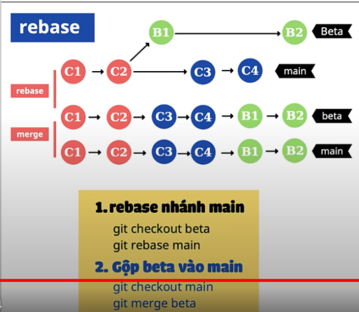
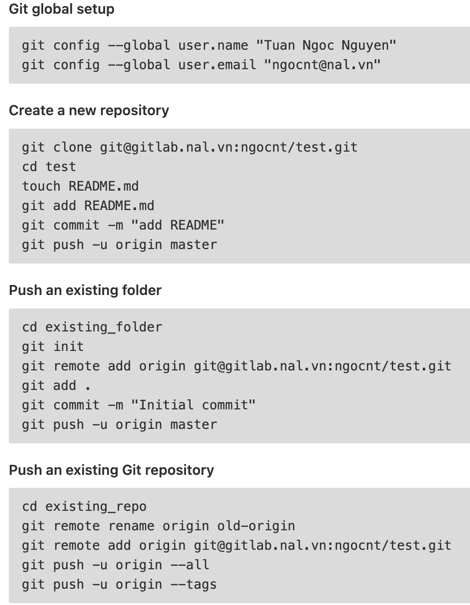

# What is Version Control?
- Version Control System: ***phần mềm quản lý phiên bản mã nguồn***
- Khi lập trình, sẽ có lúc bạn lỡ tay xoá một đoạn code vì nghĩ rằng đoạn 
code đó không phù hợp nữa, nhưng sau đó lại phát hiện là đoạn code đó bạn vẫn cần dùng, 
để nhớ lại chính xác những gì mình đã viết thật sự là rất rất khó. 
Mọi việc sẽ trở nên đơn giản hơn rất nhiều vì phần mềm quản lý phiên bản mã nguồn 
sẽ cho phép bạn dễ dàng quay lại một phiên bản trước của tập tin đó.
- Version Control System là hệ thống kiểm soát các phiên bản phân tán mã nguồn mở. 
VCS sẽ lưu trữ tất cả các file trong toàn bộ dự án và ghi lại toàn bộ lịch sử thay đổi của file. 
Mỗi sự thay đổi sẽ được lưu lại thành một version (phiên bản) hoàn toàn mới. 
Một trong số những VCS thông dụng nhất là Git.

# What is Git?
- Git là một hệ thống quản lý phiên bản phân tán (Distributed Version Control System – DVCS)
  ra đời vào năm 2005 và hiện được dùng rất phổ biến. So với các hệ thống quản lý phiên bản
  tập trung khi tất cả mã nguồn và lịch sử thay đổi chỉ được lưu một nơi là máy chủ thì trong
  hệ thống phân tán, các máy khách không chỉ "check out" phiên bản mới nhất của các tập tin mà
  là sao chép (mirror) toàn bộ kho mã nguồn (repository). Như vậy, nếu như máy chủ ngừng hoạt động,
  thì bạn hoàn toàn có thể lấy kho chứa từ bất kỳ máy khách nào để sao chép ngược trở lại máy
  chủ để khôi phục lại toàn bộ hệ thống. Mỗi checkout thực sự là một bản sao đầy đủ của tất cả
  dữ liệu của kho chứa từ máy chủ.
- Sự khác nhau cơ bản giữa Git với bất kỳ VCS khác về cơ bản là Git coi dữ liệu của nó như
  một tập hợp các “ảnh” (snapshot) của một hệ thống tập tin. Mỗi lần bạn thực hiện hành động
  “commit”, hoặc lưu lại trạng thái hiện tại của dự án trong Git. Về cơ bản, Git “chụp một bức ảnh”
  ghi lại nội dung của toàn bộ tập tin tại thời điểm đó và tạo ra một tham chiếu. Thậm chí,
  để không lãng phí tài nguyên, nếu tập tin của bạn không có sự thay đổi nào, Git sẽ không
  lưu trữ tập tin đó lại một lần nữa mà chỉ tạo một liên kết tới tập tin gốc đã tồn tại trước đó:
 
     VD: tạo 2 commit liên tiếp nhưng không thay đổi data thì sẽ không tạo được commit mới
   

# Mỗi tập tin trong Git được quản lý dựa trên ba trạng thái: Modified, Stager và Committed
- Modified: Đây là trạng thái khi bạn đã thay đổi code, tập tin nhưng chưa commit vào cơ sở
  dữ liệu. Ở trạng thái này, các tệp của bạn được sửa đổi. Bạn tạo tệp, viết mã, sửa tệp, xóa
  tệp nhưng các thay đổi không được lưu, bạn vẫn chưa để Git giám sát các tệp này.
- Stager: Trạng thái này là khi bạn đã đánh dấu sẽ commit phiên bản hiện tại của một tập
  tin đã chỉnh sửa trong lần commit sắp tới. Ở trạng thái này, các tệp của bạn được chuẩn bị
  để được cam kết trong kho lưu trữ git (.git repository). Các tệp này chưa được cam kết (commit)
  nhưng đã ủy quyền cho git để commit phiên bản này trong lần commit tiếp theo.
- Committed: Đây là trạng thái khi dữ liệu đã được lưu trữ một cách an toàn trong cơ sở dữ
  liệu. trong giai đoạn cuối cùng này, bạn đã lưu thành công các tệp trong kho lưu trữ git
  (repository) và tạo cam kết (commit) cho chúng. Bạn có thể đặt tên cho commit để bạn hoặc
  những người trong team có thể hiểu rằng lần commit đó là về vấn đề gì, xử lý việc gì.

Điều này tạo ra 3 phần riêng biệt của một dự án sử dụng Git: thư mục làm việc
(working directory), khu vực tổ chức (staging area), git directory (repository):
 
- Working directory: Là bản sao một phiên bản của dự án. Những tập tin này được kéo về (pulled) từ cơ sở dữ liệu được nén lại trong thư mục Git và lưu trên ổ cứng cho bạn sử dụng hoặc chỉnh sửa. Hoặc khi bạn tạo bất kỳ thư mục nào trong dự án của mình, thư mục đó sẽ nằm trong thư mục làm việc (working directory) hoặc trong thư mục cục bộ. Về cơ bản working directory là thư mục cục bộ trên máy tính cá nhân cho các tệp dự án của bạn.
- Staging area: Là một tập tin chứa trong thư mục Git, nó chứa thông tin về những gì sẽ được commit trong lần commit sắp tới.
- Git directory (repository): Đây là nơi mà các tệp đã ở trạng thái commit nằm. Nó lưu trữ các “siêu dữ kiện” (metadata) và cơ sở dữ liệu cho dự án của bạn. Đồng thời nó là phần được sao lưu về khi bạn tạo một bản sao (clone) của một repository.

 VD: 
- File ở Working directory gõ `git add .` -> file được chuyển tới Staging area
- Tiếp tục gõ `git commit -m "commit 2"` -> file được chuyển tới Git directory
- Tiếp tục gõ `git push` -> file được chuyển tới Remote repository
   

# Git basic (commit, branch, pull, push, merge)?
### Quy trình làm việc (workflow) hoàn chỉnh của Git
 
- Git add: Đưa code, thư mục hiện tại vào Staging Area, xác định phiên bản sẽ được commit trong lần commit tiếp theo.
   `git add .` . hoặc tên file chính xác để đưa file đó vào Staging area
- Git commit: Cam kết phiên bản trong Staging Area.
   `git commit -m "ghi chú"` chuyển toàn bộ các file nằm ở Staging area -> Git directory, chi chú trong "" là note của mỗi lần commit sẽ hiện trong log
   `git commit --amend"` sửa đổi commit cuối cùng
- Git push: Đưa code, thư mục từ Git directory (repository) đến repository từ xa (remote repository).
   `git push` chuyển dữ liệu từ local -> remote repository
   `git push --set-upstream origin <your-branch>` trong lần đầu remote chưa có nhánh mới sẽ cần chạy lệnh này để tạo nhánh đó và push
   `git push --force>` ghi đè lên remote repository bằng code ở local, mà không cần quan tâm đến việc bên phía remote đang chứa thứ gì
- `Git fetch` Nhận các tệp từ repository từ xa (remote repoitory) đến kho lưu trữ cục bộ (local repository) nhưng chưa đến working directory của bạn.
- `Git merge` Tải tệp được cập nhập từ kho lưu trữ cục bộ (local repository) đến working directory của bạn.
- `Git pull` Đây là sự kết hợp và rút ngắn của 2 câu lệnh trên. Nó sẽ đưa trực tiếp các tệp từ repository từ xa (remote repoitory) đến working directory của bạn.
- `Git diff` HEAD Nếu bạn thắc mắc tại sao phải sử dụng 2 lệnh git fetch, git merge trong khi có thể rút gọn thời gian bằng git pull, thì đó là vì có những lúc ta sẽ cần sử dụng git diff HEAD để kiểm tra sự khác biệt giữa các tệp tồn tại trong Working directory và các tệp nằm trong kho lưu trữ cục bộ (local repository).
- `Git diff` So sánh cho bạn biết sự khác biệt giữa các tqệp trong Working directory và các tệp nằm trong Staging Area chuẩn bị được commit.

### GIT Branches

- Branch là một bản sao của một project Git mà tại đó bạn có thể thay đổi bất cứ khi nào và
  sau đó kết hợp với project gốc. Các hoạt động trên mỗi branch là riêng biệt,
  không gây bất kỳ ảnh hướng nào đến các branch khác nên có thể tiến hành nhiều thay
  đổi đồng thời trên một repository.
- Bạn sẽ tạo một nhánh (branch) mới + chuyển nhánh với câu lệnh: `Git checkout -b “<your-branch>”`
- Tham khảo: 
 Giới thiệu về nhánh branch trong git: https://www.youtube.com/watch?v=l5p1WzsY7CM
 Một số lệnh thường dùng: https://www.youtube.com/watch?v=1JuYQgpbrW0
- Phân biệt giữa Git Merge và Git Rebase: https://www.youtube.com/watch?v=yn7FJvQdBTsGIT

*MERGE*: chuyển sang nhánh main, merge beta vào main. Các commit sẽ đan xen theo đúng time
được tạo vào nhánh được hợp nhất.
 

*REBASE*:
1. Chuyển sang nhánh beta, sau đó cơ sở lại nhánh beta theo nhánh main, các commit của nhánh beta chỉ được ***nối tiếp đằng sau*** các commit nhánh main
2. Thực hiện như merge ở trên
    

- Trường hợp sau khi đã hoàn thành phát triển tính năng ở nhánh mới, nhưng trong thời gian
  đó nhánh develop đã được cập nhật: 
  `git checkout develop` chuyển sang nhánh develop local  
  `git pull origin develop` pull từ origin về 
  `git checkout <your-branch>` chuyển sang nhánh của mình 
  `git rebase develop` rebase nhánh của mình theo nhánh develop được cập nhật mới nhất
   Như vậy khi push lại code lên remote repository, nhánh mới sẽ không bị conflict,
  người quản trị sẽ merge được code vào nhánh chính.

# Tạo project và đưa lên gitlab lần đầu: ví dụ trường hợp đưa project có sẵn lên gitlab
1. Sau thao tác chọn blank project ban đầu trên gitlab sẽ hiện lên các hướng dẫn sau:
 

2. Nhập lần lượt: Git global setup
    `git config --global user.name "Tuan Ngoc Nguyen"` 
   `git config --global user.email "ngocnt@nal.vn"`

3. Trường hợp đưa project có sẵn lên gitlab: Push an existing folder
    `cd existing_folder` truy cập folder existing_folder ở local 
   `git init` khởi tạo kho lưu trữ mới và trống ở local 
   `git remote add origin git@gitlab.nal.vn:ngocnt/test.git` địa chỉ khi push remote 
   `git add .` 
   `git commit -m "Initial commit"` 
   `git push -u origin master`

4. Các VD về git add, commit, push đã đưược đề cập ở trên. Ở đây sẽ nối tiếp:
    `Git status` sử dụng để hiển thị trạng thái của Git Add và Git commit, trước và sau khi add đã có sự thay đổi
    